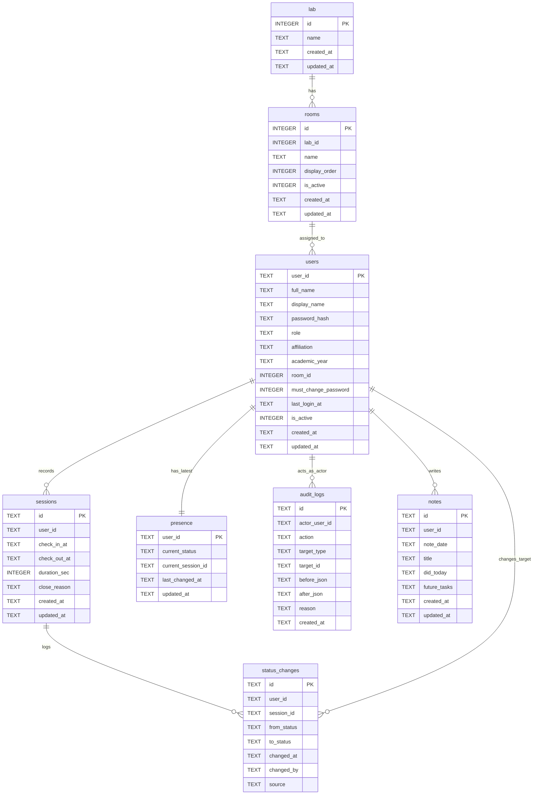
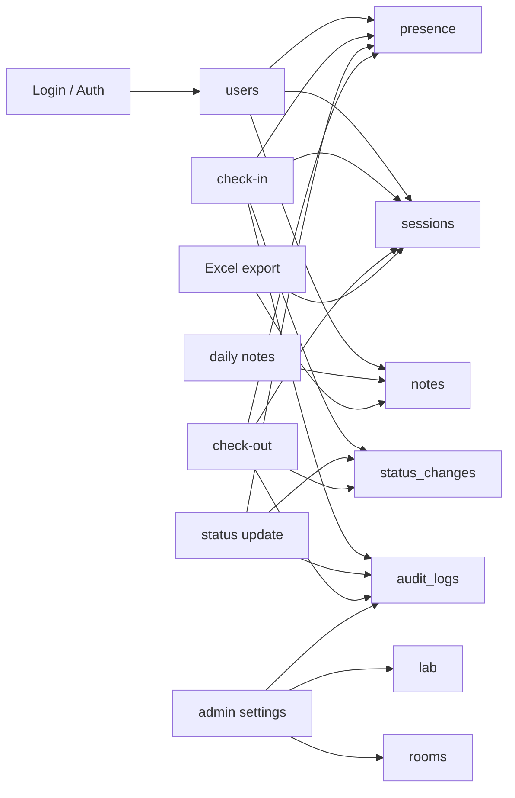

# Database Diagram

このアプリの主な保存先は SQLite (`backend/data/local.db`) です。
一部の Store は JSON/Markdown から SQLite へ移行・同期するための互換処理も持っていますが、現在の中心スキーマは `backend/app/db/sqlite_db.py` のテーブル定義です。

## ER Diagram

## Main Flow

## Notes

- `users.room_id` は `rooms.id` を参照する想定です。
- `rooms.lab_id` は `lab.id` を参照する想定です。
- `sessions.user_id`, `presence.user_id`, `notes.user_id`, `status_changes.user_id` は `users.user_id` を参照する想定です。
- `presence.current_session_id` と `status_changes.session_id` は `sessions.id` を参照する想定です。
- SQLite 定義上は `FOREIGN KEY` 制約が明示されていないため、参照整合性は主にアプリケーションコード側で管理されています。
- `notes` には `UNIQUE(user_id, note_date)` があり、1ユーザー1日につき1件の日誌になる設計です。

